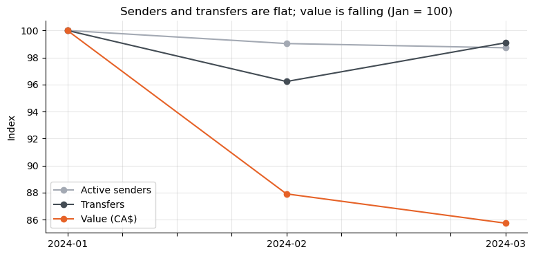
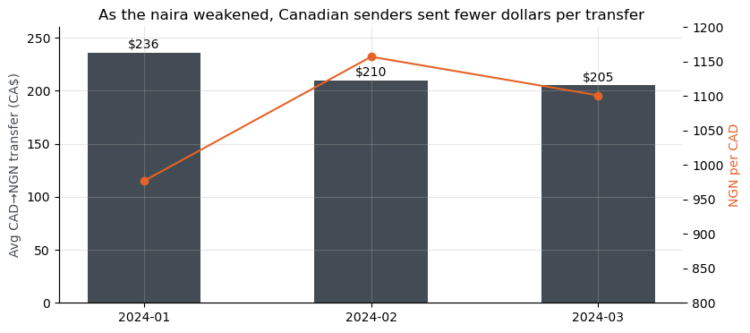
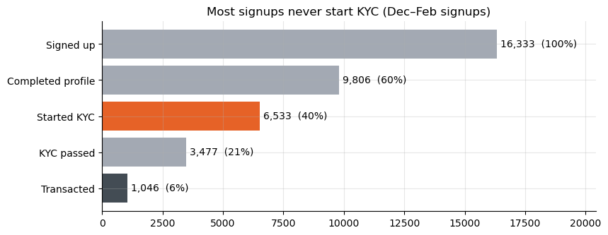
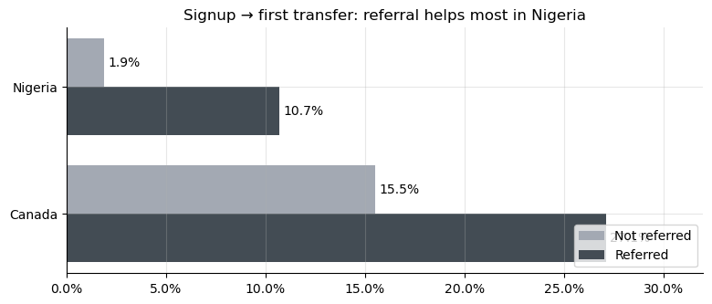

<p align="center">
  
</p>

# SendFast Q1 2024 Analysis

**SendFast** is a remittance startup that offers fast, affordable cross-border payments at competitive exchange rates. Its main corridors are Canada ↔ Nigeria.

This project analyses one quarter of SendFast transfers and signups to answer a leadership question:

> **How healthy is the business, and where should we focus next?**

> [!IMPORTANT]
> **Disclaimer: all data in this project is synthetic.** SendFast is a fictional company, and every user, transfer and figure in this repository was artificially generated for this case study. None of it comes from any real company, customer or transaction.

---

## Key findings

| | Finding | Evidence |
|---|---|---|
| 1 | **Customers stay.** | About 12,300 people send each month, and 79% of one month's senders send again the next month. |
| 2 | **Each transfer is worth less.** | Senders and transfer counts are flat, but monthly value fell 14% from January to March (CA$21.9M → CA$18.8M). The average CAD→NGN transfer fell from CA$236 to CA$205 as the naira weakened. |
| 3 | **NGN→CAD is the high-value corridor.** | It is 13.5% of remittances but 48% of remittance value, averaging CA$1,300 per transfer. 40% of these transfers are school-related. |
| 4 | **New signups rarely become senders.** | Only 6.4% of signups with at least 30 days to convert ever sent money. 60% never started KYC, rising to 70% in Nigeria. |
| 5 | **Referral gets Nigerian signups through KYC.** | Compared within each country, referred signups are 5.6× as likely to send in Nigeria and 1.7× in Canada. Referral lifts activation but not retention. |

<p align="center">
  
  
</p>
<p align="center">
  
  
</p>

## Recommendations

1. **Get Nigerian signups into KYC.** Start KYC straight after signup, show the required documents up front, and follow up with people who stall.
2. **Use referrals to drive KYC.** Pay the referral reward once the invitee passes KYC and makes a first transfer, and test the change to confirm that referral causes the lift.
3. **Protect NGN→CAD tuition payments.** Run targeted lifecycle campaigns for school-related senders, and look after the top 10% of customers, who send 51% of all value.

## Slide deck

The findings are presented as a 12-slide leadership deck with speaker notes:
[`deck/SendFast_Q1_2024_Leadership_Review.pptx`](deck/SendFast_Q1_2024_Leadership_Review.pptx).

## Data

Both files are synthetic. They were generated for this case study and contain no real customer or company data.

| File | Rows | Description |
|---|---|---|
| [`data/transactions.csv`](data/transactions.csv) | 164,882 | Every transfer from 31 Dec 2023 to 31 Mar 2024: amounts, currencies, exchange rate, purpose and CAD value (`BaseAmount`). |
| [`data/users.csv`](data/users.csv) | 21,906 | A slice of users who signed up from 1 Dec 2023 to 31 Mar 2024: signup date, country, KYC status, profile completion and referral code. |

**How to read the results:**
- **Two different populations.** The users table is a slice of new signups, while the transactions table covers every customer who sent money. Base health, retention and corridor results cover all customers. Funnel and referral results cover new signups only.
- **December is a single day.** Transfers begin on 31 Dec, so all monthly comparisons use January–March only.
- **Same-currency rows are not remittances.** NGN→NGN and CAD→CAD rows are account debits and are excluded from corridor analysis.
- **Gender and age are unreliable.** A placeholder birth date (2001-01-01) nearly always comes with gender "Non-Binary", which suggests a form default, so neither field is used.
- **Two links are associations, not proven causes.** The exchange-rate link covers only three months, and the referral effect rests on 307 referred Nigerian signups.

## Method

The notebook loads both CSVs into an in-memory SQLite database and answers each question in SQL, with pandas and matplotlib used for checks and charts:

1. **Data quality checks.** Duplicates, how the two tables relate, partial periods, placeholder values and same-currency debits.
2. **Base health.** Distinct monthly senders, transfers and value.
3. **Retention.** Month-to-month and week-to-week retention.
4. **Value.** Transfer size against the NGN/CAD exchange rate.
5. **Corridors.** Share and purpose by corridor, and how concentrated value is across customers.
6. **Signup funnel.** A cohort of Dec–Feb signups (at least 30 days to convert), broken down by country.
7. **Referral.** Conversion within each country, KYC progress, and retention after the first transfer.

## Repository structure

```
fintech-customer-analytics-case-study/
├── notebooks/
│   └── SendFast_Analysis.ipynb   # Full analysis, written as a narrative
├── deck/
│   └── SendFast_Q1_2024_Leadership_Review.pptx   # Leadership presentation
├── data/
│   ├── transactions.csv
│   └── users.csv
├── figures/                      # Charts exported from the notebook
├── assets/                       # SendFast logo (original and transparent versions)
├── requirements.txt
└── README.md
```

## Running the analysis

```bash
git clone https://github.com/frankolanari/fintech-customer-analytics-case-study.git
cd fintech-customer-analytics-case-study
python -m venv .venv && source .venv/bin/activate
pip install -r requirements.txt
jupyter notebook notebooks/SendFast_Analysis.ipynb
```

The notebook runs from top to bottom in about 10 seconds.

## Tools

Python · pandas · SQLite (SQL) · matplotlib · Jupyter
